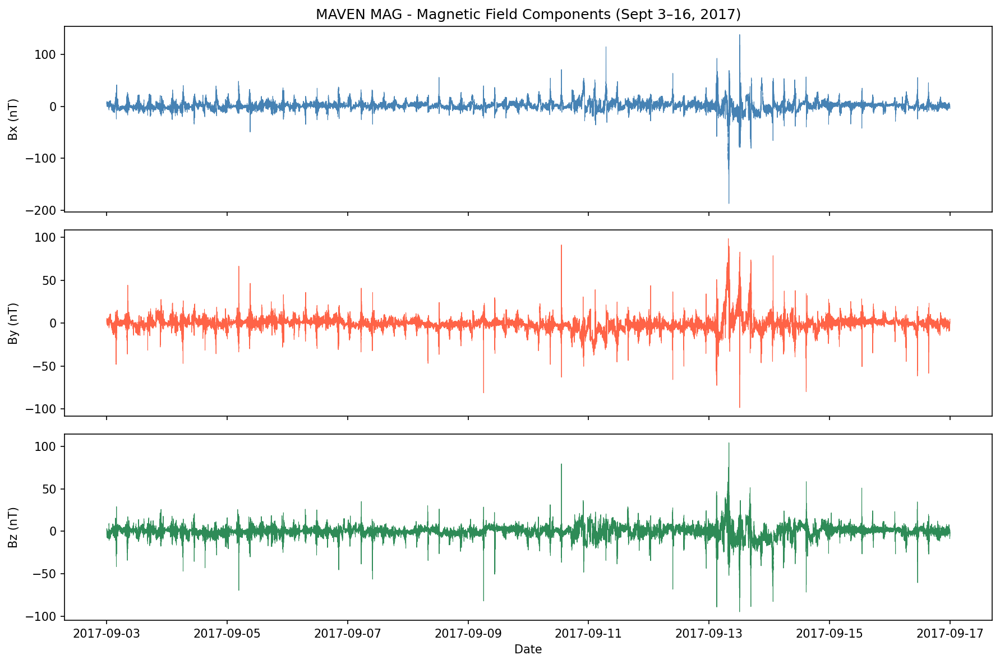
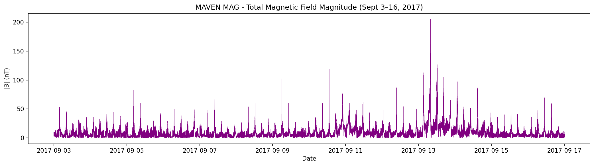
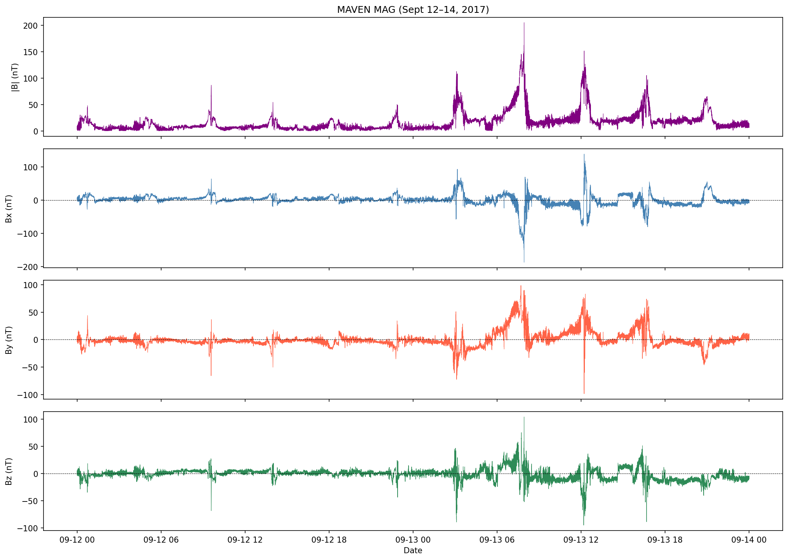

# Magnetic Field Response to Solar Storms on Different Planets

### Team

Gigi Albers @gigi-albers06

Ryan Pennington @ryan-pennington97

Makenna Blatnick @makennablatnick

### Summary

Solar storms often impact the Earth in many different ways. The events on the surface include power grid blackouts, damage to satellites, and can increase 
atmospheric drag. The interaction of charged particles with Earth's magnetosphere protects us from the majority of these surface events. We will explore
how these interactions differ between Earth and Mars.

### Background

Data from NASA's MAVEN and ESA's Mars Express missions during solar events in 2017 and 2024 have provided evidence that since Mars has little to no
magnetic barrier, the solar storms often cause an increase of extreme radiation levels on the surface. Often during solar storms on Earth, we are
protected by the shape of the magnetic field since it acts like a rock in the river and deflects the charged particles.

Exploring these how planet's interaction is different will provide insight to the consideration of human habitability, and the challenges that come
along with it.

### Problem Statement

We will explore how solar storms impact both the weather on Earth and magnetic fields. We will then take our findings and compare them to the "disorganized"
magnetic field on Mars.

- How do the magnetic field characteristics of Mars effect it's habitability?
- In what ways does Mars' abnormal electric field change the way solar winds impact it?

### Datasets

- NASA MAVEN data archive to explore Mars surface effects: <https://pds-atmospheres.nmsu.edu/data_and_services/atmospheres_data/MAVEN/maven_main.html> 
- ACE data to monitor solar wind: <https://izw1.caltech.edu/ACE/ASC/browse/view_browse_data.html?.com>
- NOAA Space Weather Prediction Center: <https://www.swpc.noaa.gov/products/real-time-solar-wind>
- SWMF Datasets for weather prediction and impacts on Mars: <https://clasp.engin.umich.edu/research/theory-computational-methods/space-weather-modeling-framework/swmf-downloadable-software/>

### Methodology

We will look at solar storm events using data from NASA's MAVEN mission, mainly focusing on events from 2017 and 2024 when there was an increase in solar
activity. From this dataset, we will pull things like magnetic field strength, solar wind speed, and particle flux to see how Mars reacted to these storms,
and compare that data to Earth's using space weather data like geomagnetic indexes and satellite observations.

We plan to make time-series graphs that show what is happening before, during, and after the storms for both planets so we can track the differences in
patterns. We will also puth the Earth and Mars data charts side-by-side which should make it easier to draw comparisons.

### Expected Outcomes

We expect to see large differences between how Earth and Mars responds to solar storms, based mostly on the difference in the respective planets' fields.
On Earth, we anticipate disturbances like geomagnetic storms distorting the magnetosphere. While on Mars, we expect a much large amount of electromagnetic
radiation and energetic particles reaching the planet's day-time surface. 

We will also consider how the solar winds played a role in removing Mars' atmosphere, and how much does the atmospheric stripping rate change during a 
solar event. Overall, this should show how important a strong magnetic field is for planetary habitability.

### References

<https://svs.gsfc.nasa.gov/5502/#:~:text=Mars%27s%20magnetosphere%20experienced%20a%20strong,the%20magnetic%20field%20is%20strongest>

<https://www.space.com/astronomy/sun/reining-in-the-sun-venus-earth-and-jupiter-may-work-together-to-reduce-the-risk-of-extreme-solar-storms>

<https://svs.gsfc.nasa.gov/5502/>

### Data Exploration Plots

Maven Data 

There was a solar event on September 14, 2017 

These plots show the spike in each direction of the megnetopshere of mars 

This plot shows the magnitude of the magnetic field during this event

This plot shows a zoomed in version of the spike, focusing on when the solar wind made it to Mars (Sept 12-16)

